# ProjectUKK - Sistem Informasi Pajak Bumi dan Bangunan (PBB)

<div align="center">


**Aplikasi web untuk mengelola data Pajak Bumi dan Bangunan (PBB) dan informasi penduduk secara terpusat**

[Fitur](#fitur-utama) • [Instalasi](#instalasi) • [Dokumentasi](#dokumentasi) • [Kontribusi](#kontribusi)

</div>

---

## 📖 Daftar Isi

-   [Tentang Aplikasi](#tentang-aplikasi)
-   [Fitur Utama](#fitur-utama)
-   [Teknologi yang Digunakan](#teknologi-yang-digunakan)
-   [Persyaratan Sistem](#persyaratan-sistem)
-   [Instalasi](#instalasi)
-   [Konfigurasi](#konfigurasi)
-   [Penggunaan](#penggunaan)
-   [Struktur Proyek](#struktur-proyek)
-   [Database - ERD](#-database---entity-relationship-diagram-erd)
-   [API Endpoints](#api-endpoints)
-   [Dokumentasi](#dokumentasi)
-   [Troubleshooting](#troubleshooting)
-   [Kontribusi](#kontribusi)
-   [Lisensi](#lisensi)

---

## 📋 Tentang Aplikasi

**ProjectUKK** adalah aplikasi web berbasis Laravel yang dirancang untuk mengelola sistem Pajak Bumi dan Bangunan (PBB) di tingkat kelurahan/desa. Aplikasi ini memfasilitasi:

-   📊 Manajemen data penduduk (Warga)
-   🏠 Pencatatan objek pajak (properti/bangunan)
-   💰 Pengelolaan data PBB dan status pembayaran
-   👥 Manajemen pengguna dengan role-based access control
-   📈 Pelaporan dan ekspor data (PDF, Excel)
-   🔐 Sistem autentikasi dan otorisasi yang aman

Aplikasi ini cocok untuk digunakan oleh **Kelurahan/Desa**, **Kecamatan**, atau **Dinas Pajak Lokal** untuk mengelola data PBB secara efisien dan terorganisir.

---

## ✨ Fitur Utama

### 🔐 Autentikasi & Otorisasi

-   ✅ Sistem login dengan email dan password
-   ✅ Role-based access control (Admin & User)
-   ✅ Registrasi pengguna baru
-   ✅ Logout dan session management
-   ✅ Password hashing aman dengan bcrypt
-   ✅ **ADMIN Access**: Dashboard, CRUD Warga, CRUD PBB, Laporan, Export, Print
-   ✅ **USER Access**: Input Data Warga, Input Data PBB (Limited - Create Only)
-   ✅ Dynamic sidebar berdasarkan role pengguna
-   ✅ Middleware role checking untuk setiap route

### 👥 Manajemen Data Penduduk

-   ✅ CRUD lengkap untuk data Warga (penduduk)
-   ✅ Input NIK (Nomor Induk Kependudukan) dan KK (Kartu Keluarga)
-   ✅ Data personal: nama, alamat, tempat/tanggal lahir
-   ✅ Informasi kontak dan agama
-   ✅ Pencarian dan filter data penduduk
-   ✅ Validasi data otomatis

### 🏠 Manajemen Pajak Bumi & Bangunan

-   ✅ CRUD lengkap untuk data PBB
-   ✅ Input NOP (Nomor Objek Pajak)
-   ✅ Pemetaan properti ke pemilik (via NIK)
-   ✅ Informasi detail objek: lokasi, luas tanah/bangunan, jenis bangunan
-   ✅ Status tanah & bangunan (Milik Sendiri, Sewa, Hibah)
-   ✅ Tracking nilai pajak dan tahun perolehan
-   ✅ Manajemen status pembayaran: Lunas, Belum Lunas, Cicilan
-   ✅ Cascading validation terhadap data penduduk

### 📊 Dashboard & Analytics

-   ✅ Overview statistik real-time
-   ✅ Total jumlah penduduk terdaftar
-   ✅ Total jumlah objek pajak
-   ✅ Total nilai pajak tahun ini
-   ✅ Breakdown status pembayaran (Lunas, Belum Lunas, Cicilan)
-   ✅ Visualisasi data

### 📈 Pelaporan & Ekspor

-   ✅ Lihat data dalam format tabel dengan pagination
-   ✅ Export data ke format PDF dengan styling profesional
-   ✅ Export data ke format Excel (.xlsx)
-   ✅ Laporan terstruktur dengan header dan footer
-   ✅ Print-friendly report dengan tombol cetak
-   ✅ Print Data Warga - Cetak semua data penduduk
-   ✅ Print Data PBB - Cetak semua data pajak dengan ringkasan status pembayaran
-   ✅ Export PDF untuk Data Warga dan PBB
-   ✅ Summary cards dengan statistik pembayaran

### 👨‍💼 Manajemen Pengguna (Admin Only)

-   ✅ Daftar semua pengguna sistem
-   ✅ Create/Read/Update/Delete pengguna
-   ✅ Assign role (Admin/User)
-   ✅ Manage akses pengguna

---

## 🛠 Teknologi yang Digunakan

### Backend

| Teknologi         | Versi    | Fungsi                         |
| ----------------- | -------- | ------------------------------ |
| **Laravel**       | 12.0     | Web Framework PHP modern       |
| **PHP**           | 8.2+     | Bahasa pemrograman server-side |
| **MySQL/MariaDB** | 5.7+     | Database relasional            |
| **Eloquent ORM**  | Built-in | Object-relational mapping      |

### Frontend

| Teknologi           | Fungsi                      |
| ------------------- | --------------------------- |
| **Blade**           | Template engine Laravel     |
| **Tailwind CSS**    | Utility-first CSS framework |
| **Alpine.js**       | JavaScript framework ringan |
| **HTML5**           | Markup struktur             |
| **JavaScript ES6+** | Interaktivitas client-side  |

### Build & Development Tools

| Tool             | Fungsi                  |
| ---------------- | ----------------------- |
| **Vite**         | Build tool & dev server |
| **Composer**     | PHP dependency manager  |
| **NPM**          | Node package manager    |
| **Tailwind CSS** | CSS styling             |

### Additional Libraries

-   **Laravel Pint** - Code style formatter
-   **PHPUnit** - Unit testing framework
-   **Faker** - Fake data generator untuk testing
-   **Laravel Tinker** - REPL untuk Laravel

---

## 💻 Persyaratan Sistem

### Minimum Requirements

-   **PHP 8.2** atau lebih tinggi
-   **MySQL 5.7** atau **MariaDB 10.2** atau lebih tinggi
-   **Composer 2.0** atau lebih tinggi
-   **Node.js 18+** untuk build tools
-   **npm 9+** atau **yarn**

### Rekomendasi

-   **PHP 8.4** (latest stable)
-   **MySQL 8.0** atau **MariaDB 11.0**
-   **SSD Storage** untuk performa optimal
-   **RAM 4GB+** untuk development

### Server Requirements (Production)

-   **Dedicated Hosting atau VPS**
-   **SSL Certificate** (HTTPS)
-   **PHP-FPM atau Apache with mod_php**
-   **MySQL Server terpisah** (recommended)
-   **Backup system** yang reguler

---

## 🚀 Instalasi

### Prerequisite

Pastikan sudah ter-install:

-   Git
-   PHP 8.2+
-   MySQL/MariaDB
-   Composer
-   Node.js & npm

### Langkah 1: Clone Repository

```bash
git clone https://github.com/ka080808/projectUKK.git
cd projectUKK
```

### Langkah 2: Install Dependencies

```bash
# Install PHP dependencies
composer install

# Install Node dependencies
npm install
```

### Langkah 3: Setup Environment

```bash
# Copy environment file
cp .env.example .env

# Generate application key
php artisan key:generate
```

### Langkah 4: Konfigurasi Database

Edit file `.env` dan sesuaikan database configuration:

```env
DB_CONNECTION=mysql
DB_HOST=127.0.0.1
DB_PORT=3306
DB_DATABASE=projectukk
DB_USERNAME=root
DB_PASSWORD=
```

### Langkah 5: Jalankan Migrations & Seeder

```bash
# Create database tables
php artisan migrate

# Optional: Seed sample data
php artisan db:seed
```

### Langkah 6: Build Frontend Assets

```bash
# Development build
npm run dev

# Production build
npm run build
```

### Langkah 7: Jalankan Aplikasi

```bash
# Start development server
php artisan serve

# App akan accessible di http://localhost:8000
```

---

## ⚙️ Konfigurasi

### Environment Variables (.env)

```env
# App Configuration
APP_NAME="ProjectUKK"
APP_ENV=local
APP_DEBUG=true
APP_URL=http://localhost:8000

# Database Configuration
DB_CONNECTION=mysql
DB_HOST=127.0.0.1
DB_PORT=3306
DB_DATABASE=projectukk
DB_USERNAME=root
DB_PASSWORD=

# Mail Configuration (optional)
MAIL_MAILER=smtp
MAIL_HOST=smtp.mailtrap.io
MAIL_PORT=2525
MAIL_USERNAME=your_username
MAIL_PASSWORD=your_password

# Cache & Session
CACHE_STORE=file
SESSION_DRIVER=file
```

### Konfigurasi Web Server (Apache)

Pastikan `.htaccess` di folder `public/` sudah ada dan benar. Untuk subfolder:

```apache
<IfModule mod_rewrite.c>
    <IfModule mod_negotiation.c>
        Options -MultiViews -Indexes
    </IfModule>

    RewriteEngine On
    RewriteCond %{HTTP:Authorization} .
    RewriteRule ^(.*)$ public/$1 [L]
    RewriteCond %{REQUEST_FILENAME} !-f
    RewriteCond %{REQUEST_FILENAME} !-d
    RewriteRule ^(.*)$ public/index.php?/$1 [QSA,L]
</IfModule>
```

---

## 📱 Penggunaan

### Login ke Aplikasi

1. Buka browser dan akses `http://localhost:8000`
2. Klik "Login" di halaman welcome
3. Masukkan email dan password
4. Sistem akan redirect ke dashboard

### Default Test Credentials

Jika menggunakan seeder, gunakan:

-   **Email**: `admin@example.com` (Admin)
-   **Password**: `password`

### Fitur Utama

#### Dashboard

-   Menampilkan overview statistik PBB
-   Ringkasan jumlah warga dan properti
-   Total nilai pajak tahun ini
-   Status pembayaran breakdown

#### Manajemen Warga

-   **Lihat Daftar**: `/warga` - Melihat semua data penduduk
-   **Tambah Warga**: `/warga/create` - Menambah penduduk baru
-   **Edit Warga**: `/warga/{id}/edit` - Mengubah data penduduk
-   **Hapus Warga**: Delete dari list (Admin only)

#### Manajemen PBB

-   **Lihat Daftar**: `/pbb` - Melihat semua data PBB
-   **Tambah PBB**: `/pbb/create` - Menambah objek pajak baru
-   **Edit PBB**: `/pbb/{id}/edit` - Mengubah data PBB
-   **Hapus PBB**: Delete dari list (Admin only)

#### Pelaporan

-   **Generate Report**: `/report` - Buat laporan
-   **Export PDF**: Ekspor data ke PDF
-   **Export Excel**: Ekspor data ke spreadsheet

---

## 📊 Struktur Proyek

```
projectUKK/
├── app/
│   ├── Http/
│   │   ├── Controllers/
│   │   │   ├── AuthController.php          # Autentikasi
│   │   │   ├── DashboardController.php     # Dashboard
│   │   │   ├── WargaController.php         # Data Penduduk
│   │   │   ├── PBBController.php           # Data PBB
│   │   │   └── ReportController.php        # Pelaporan
│   │   └── Middleware/
│   │       └── Authenticate.php
│   ├── Models/
│   │   ├── User.php                        # Model User
│   │   ├── Warga.php                       # Model Penduduk
│   │   └── PBB.php                         # Model PBB
│   └── Exports/
│       └── PBBExport.php                   # Excel Export
│
├── database/
│   ├── migrations/
│   │   ├── create_users_table.php
│   │   ├── create_warga_table.php
│   │   └── create_pbb_table.php
│   ├── factories/
│   │   ├── UserFactory.php
│   │   ├── WargaFactory.php
│   │   └── PBBFactory.php
│   └── seeders/
│       ├── DatabaseSeeder.php
│       └── PBBSeeder.php
│
├── resources/
│   ├── views/
│   │   ├── welcome.blade.php               # Halaman utama
│   │   ├── auth/
│   │   │   ├── login.blade.php
│   │   │   └── register.blade.php
│   │   ├── dashboard/
│   │   │   └── index.blade.php
│   │   ├── warga/
│   │   │   ├── index.blade.php
│   │   │   ├── create.blade.php
│   │   │   └── edit.blade.php
│   │   ├── pbb/
│   │   │   ├── index.blade.php
│   │   │   ├── create.blade.php
│   │   │   └── edit.blade.php
│   │   ├── report/
│   │   │   └── index.blade.php
│   │   └── layouts/
│   │       └── app.blade.php
│   ├── css/
│   │   └── app.css                         # Tailwind CSS
│   └── js/
│       ├── app.js
│       └── bootstrap.js
│
├── routes/
│   ├── web.php                             # Web routes
│   └── api.php
│
├── config/
│   ├── app.php                             # App config
│   ├── database.php                        # Database config
│   ├── auth.php                            # Auth config
│   └── filesystems.php                     # File storage config
│
├── tests/
│   ├── Feature/
│   └── Unit/
│
├── public/
│   ├── index.php                           # Entry point
│   └── ...
│
├── bootstrap/
├── storage/
├── vendor/
├── composer.json
├── package.json
├── vite.config.js
├── tailwind.config.js
├── .env.example
├── ERD.md                                  # Database diagram
├── UML.md                                  # System design
├── LARAGON_SETUP.md
└── README.md
```

---

## 🗄️ Database

### Diagram Entity Relationship (ERD)

#### 📊 Entity Relationship Diagram (Visual)

```
┌──────────────────────────────────┐
│            USERS                 │
├──────────────────────────────────┤
│ PK │ id                  (BIGINT)│
│    │ name               (STRING) │
│    │ email              (STRING) │◄──┐ UNIQUE
│    │ password           (STRING) │   │
│    │ role               (ENUM)   │   │
│    │ email_verified_at  (DATETIME)   │
│    │ remember_token     (STRING) │   │
│    │ created_at         (DATETIME)   │
│    │ updated_at         (DATETIME)   │
└──────────────────────────────────┘


┌──────────────────────────────────┐         ┌──────────────────────────────────┐
│            WARGA                 │  1:∞    │            PBB                   │
├──────────────────────────────────┤────────→├──────────────────────────────────┤
│ PK │ id                  (BIGINT)│         │ PK │ id                  (BIGINT)│
│    │ nik                (STRING) │◄────────┤ FK │ nik_pemilik        (STRING)│
│    │ no_kk              (STRING) │         │    │ nop                (STRING) │
│    │ nama_lengkap       (STRING) │         │    │ nama_pemilik       (STRING) │
│    │ alamat             (STRING) │         │    │ alamat_objek       (STRING) │
│    │ rt                (INTEGER) │         │    │ rt                (INTEGER) │
│    │ rw                (INTEGER) │         │    │ rw                (INTEGER) │
│    │ jenis_kelamin       (ENUM)  │         │    │ kelurahan          (STRING) │
│    │ tempat_lahir       (STRING) │         │    │ kecamatan          (STRING) │
│    │ tanggal_lahir        (DATE) │         │    │ kabupaten          (STRING) │
│    │ no_telp            (STRING) │         │    │ provinsi           (STRING) │
│    │ agama              (STRING) │         │    │ luas_tanah        (INTEGER) │
│    │ created_at        (DATETIME)│         │    │ luas_bangunan     (INTEGER) │
│    │ updated_at        (DATETIME)│         │    │ status_tanah       (STRING) │
│    │                             │         │    │ status_bangunan    (STRING) │
│    │ ◆ UNIQUE(nik)              │         │    │ jenis_bangunan     (STRING) │
│    │ ◆ UNIQUE(no_kk)            │         │    │ tahun_perolehan   (INTEGER) │
│    │ ◆ INDEXED                  │         │    │ nilai_pajak_tahun_ini(BIGINT)
└──────────────────────────────────┘         │    │ status_pembayaran  (STRING) │
                                              │    │ keterangan          (TEXT)  │
                                              │    │ created_at        (DATETIME)│
                                              │    │ updated_at        (DATETIME)│
                                              │    │                             │
                                              │    │ ◆ UNIQUE(nop)              │
                                              │    │ ◆ INDEXED(nik_pemilik)     │
                                              └──────────────────────────────────┘
```

#### 🔑 Penjelasan ERD

**Keterangan Simbol:**

-   `PK` = Primary Key (Kunci Utama)
-   `FK` = Foreign Key (Kunci Tamu/Asing)
-   `◆` = Constraint/Index
-   `1:∞` = Relasi One-to-Many

#### 📋 Identifikasi Entitas dan Atributnya

##### **ENTITAS 1: USERS (Pengguna Sistem)**

| Atribut             | Tipe Data    | Constraint         | Keterangan                    |
| ------------------- | ------------ | ------------------ | ----------------------------- |
| `id`                | BIGINT       | PK, AUTO_INCREMENT | Kunci utama user              |
| `name`              | VARCHAR(255) | NOT NULL           | Nama lengkap pengguna         |
| `email`             | VARCHAR(255) | UNIQUE, NOT NULL   | Email unik sebagai identifier |
| `email_verified_at` | TIMESTAMP    | NULLABLE           | Waktu verifikasi email        |
| `password`          | VARCHAR(255) | NOT NULL           | Password terenkripsi (hashed) |
| `role`              | ENUM         | DEFAULT 'user'     | Peran: admin atau user        |
| `remember_token`    | VARCHAR(100) | NULLABLE           | Token untuk remember me       |
| `created_at`        | TIMESTAMP    | CURRENT_TIMESTAMP  | Waktu pembuatan record        |
| `updated_at`        | TIMESTAMP    | CURRENT_TIMESTAMP  | Waktu update terakhir         |

**Fungsi:** Menyimpan data pengguna sistem untuk autentikasi dan manajemen akses

---

##### **ENTITAS 2: WARGA (Data Penduduk)**

| Atribut         | Tipe Data    | Constraint                | Keterangan                          |
| --------------- | ------------ | ------------------------- | ----------------------------------- |
| `id`            | BIGINT       | PK, AUTO_INCREMENT        | Kunci utama warga                   |
| `nik`           | VARCHAR(16)  | UNIQUE, NOT NULL, INDEXED | Nomor Induk Kependudukan (16 digit) |
| `no_kk`         | VARCHAR(16)  | UNIQUE, NOT NULL          | Nomor Kartu Keluarga                |
| `nama_lengkap`  | VARCHAR(255) | NOT NULL                  | Nama lengkap penduduk               |
| `alamat`        | TEXT         | NOT NULL                  | Alamat lengkap                      |
| `rt`            | INT          | NOT NULL                  | Nomor RT (Rukun Tetangga)           |
| `rw`            | INT          | NOT NULL                  | Nomor RW (Rukun Warga)              |
| `jenis_kelamin` | ENUM         | NOT NULL                  | Laki-laki / Perempuan               |
| `tempat_lahir`  | VARCHAR(255) | NOT NULL                  | Tempat lahir                        |
| `tanggal_lahir` | DATE         | NOT NULL                  | Tanggal lahir                       |
| `no_telp`       | VARCHAR(15)  | NULLABLE                  | Nomor telepon                       |
| `agama`         | VARCHAR(50)  | NOT NULL                  | Agama yang dianut                   |
| `created_at`    | TIMESTAMP    | CURRENT_TIMESTAMP         | Waktu pembuatan record              |
| `updated_at`    | TIMESTAMP    | CURRENT_TIMESTAMP         | Waktu update terakhir               |

**Fungsi:** Menyimpan data kependudukan/penduduk yang menjadi dasar untuk data PBB

---

##### **ENTITAS 3: PBB (Pajak Bumi dan Bangunan)**

| Atribut                 | Tipe Data    | Constraint                | Keterangan                           |
| ----------------------- | ------------ | ------------------------- | ------------------------------------ |
| `id`                    | BIGINT       | PK, AUTO_INCREMENT        | Kunci utama PBB                      |
| `nop`                   | VARCHAR(18)  | UNIQUE, NOT NULL, INDEXED | Nomor Objek Pajak (standar 18 digit) |
| `nik_pemilik`           | VARCHAR(16)  | FK, NOT NULL, INDEXED     | Referensi ke WARGA.nik               |
| `nama_pemilik`          | VARCHAR(100) | NOT NULL                  | Nama pemilik objek                   |
| `alamat_objek`          | TEXT         | NOT NULL                  | Alamat objek pajak                   |
| `rt`                    | INT          | NOT NULL                  | Nomor RT lokasi objek                |
| `rw`                    | INT          | NOT NULL                  | Nomor RW lokasi objek                |
| `kelurahan`             | VARCHAR(100) | NOT NULL                  | Kelurahan/Desa                       |
| `kecamatan`             | VARCHAR(100) | NOT NULL                  | Kecamatan                            |
| `kabupaten`             | VARCHAR(100) | NOT NULL                  | Kabupaten/Kota                       |
| `provinsi`              | VARCHAR(100) | NOT NULL                  | Provinsi                             |
| `luas_tanah`            | INT          | NOT NULL                  | Luas tanah dalam m²                  |
| `luas_bangunan`         | INT          | DEFAULT 0                 | Luas bangunan dalam m²               |
| `status_tanah`          | VARCHAR(50)  | NOT NULL                  | Milik Sendiri / Sewa / Hibah         |
| `status_bangunan`       | VARCHAR(50)  | NOT NULL                  | Milik Sendiri / Sewa / Hibah         |
| `jenis_bangunan`        | VARCHAR(100) | NOT NULL                  | Rumah / Gedung / Pabrik / Toko / dll |
| `tahun_perolehan`       | INT          | NOT NULL                  | Tahun perolehan/pembangunan          |
| `nilai_pajak_tahun_ini` | BIGINT       | NOT NULL                  | Nilai pajak tahun berjalan           |
| `status_pembayaran`     | VARCHAR(50)  | DEFAULT 'Belum Lunas'     | Lunas / Belum Lunas / Cicilan        |
| `keterangan`            | TEXT         | NULLABLE                  | Catatan tambahan                     |
| `created_at`            | TIMESTAMP    | CURRENT_TIMESTAMP         | Waktu pembuatan record               |
| `updated_at`            | TIMESTAMP    | CURRENT_TIMESTAMP         | Waktu update terakhir                |

**Fungsi:** Menyimpan data Pajak Bumi dan Bangunan beserta informasi properti dan pemiliknya

---

#### 🔗 Relasi Antar Entitas

##### **Relasi 1: WARGA ↔ PBB (One-to-Many)**

```
WARGA (1) ───────→ (∞) PBB
   ↓                    ↓
  nik ←─────FK─────── nik_pemilik
```

-   **Tipe Relasi:** One-to-Many (1:∞)
-   **Keterangan:**

    -   1 WARGA dapat memiliki banyak PBB (satu orang bisa memiliki beberapa objek pajak)
    -   Setiap PBB harus mereferensikan tepat 1 WARGA (setiap properti harus punya pemilik)

-   **Primary Key:** `WARGA.nik` (Nomor Induk Kependudukan)
-   **Foreign Key:** `PBB.nik_pemilik` → `WARGA.nik`
-   **Cascading Action:** `ON DELETE CASCADE` (Jika warga dihapus, semua PBB miliknya juga terhapus)

**Implementasi di Database:**

```sql
ALTER TABLE pbb
ADD CONSTRAINT fk_pbb_warga
FOREIGN KEY (nik_pemilik)
REFERENCES warga(nik)
ON DELETE CASCADE
ON UPDATE CASCADE;
```

---

#### ✅ Verifikasi Kebenaran ERD

##### **Checklist Verifikasi:**

| Aspek                    | Status | Penjelasan                                        |
| ------------------------ | ------ | ------------------------------------------------- |
| **Identifikasi Entitas** | ✅     | 3 entitas teridentifikasi: USERS, WARGA, PBB      |
| **Primary Key**          | ✅     | Setiap entitas memiliki PK unik (id)              |
| **Atribut Lengkap**      | ✅     | Semua atribut dari migration sudah terdokumentasi |
| **Foreign Key**          | ✅     | PBB.nik_pemilik → WARGA.nik sudah terdefinisi     |
| **Relasi Logical**       | ✅     | Relasi 1:∞ antara WARGA dan PBB sudah tepat       |
| **Constraints**          | ✅     | UNIQUE, NOT NULL, INDEXED sudah tercantum         |
| **Cascading**            | ✅     | ON DELETE CASCADE sudah ditetapkan                |
| **Tipe Data**            | ✅     | Semua tipe data sesuai kebutuhan dan efisien      |
| **Normalisasi**          | ✅     | Data sudah ternormalisasi minimal 3NF             |
| **Business Logic**       | ✅     | Semua requirement bisnis tercermin dalam schema   |

---

##### **Validasi Lanjutan:**

1. **NIK sebagai PK di WARGA**: ✅

    - NIK adalah identifier unik nasional untuk setiap warga negara
    - Lebih meaningful daripada menggunakan auto-increment id

2. **Foreign Key di PBB**: ✅

    - Menjamin data integrity (tidak ada PBB tanpa pemilik yang valid)
    - Cascading delete mencegah orphaned records

3. **Unique Constraint pada NOP**: ✅

    - NOP (Nomor Objek Pajak) adalah identitas unik untuk setiap properti
    - Mencegah duplikasi data pajak

4. **Tabel USERS**: ✅

    - Terpisah dari WARGA (user sistem bisa berbeda dengan data penduduk)
    - Memungkinkan multiple users dengan role-based access

5. **Status Fields**: ✅
    - Status pembayaran, status tanah, status bangunan diperlukan untuk tracking
    - Bisa diperbaiki dengan foreign key ke master table (future enhancement)

---

### Schema Utama

#### Tabel: `users`

Menyimpan data pengguna sistem

```sql
- id (Primary Key)
- name (String)
- email (Unique)
- password (Hashed)
- role (Enum: admin, user)
- email_verified_at (Timestamp)
- timestamps
```

#### Tabel: `warga`

Menyimpan data penduduk

```sql
- id (Primary Key)
- nik (String, Unique)          -- Nomor Induk Kependudukan
- no_kk (String, Unique)        -- Nomor Kartu Keluarga
- nama_lengkap (String)
- alamat (String)
- rt, rw (Integer)
- jenis_kelamin (Enum)
- tempat_lahir (String)
- tanggal_lahir (Date)
- no_telp (String)
- agama (String)
- timestamps
```

#### Tabel: `pbb`

Menyimpan data Pajak Bumi dan Bangunan

```sql
- id (Primary Key)
- nop (String, Unique)          -- Nomor Objek Pajak
- nik_pemilik (Foreign Key)     -- References warga.nik
- nama_pemilik (String)
- alamat_objek (String)
- rt, rw (Integer)
- kelurahan, kecamatan, kabupaten, provinsi (String)
- luas_tanah (Integer)          -- dalam m²
- luas_bangunan (Integer)       -- dalam m²
- status_tanah (String)         -- Milik Sendiri, Sewa, Hibah
- status_bangunan (String)      -- Milik Sendiri, Sewa, Hibah
- jenis_bangunan (String)
- tahun_perolehan (Integer)
- nilai_pajak_tahun_ini (Big Integer)
- status_pembayaran (String)    -- Lunas, Belum Lunas, Cicilan
- keterangan (Text)
- timestamps
```

### Relasi Database

```
Warga (1) ──────→ (∞) PBB
  |                  |
  ├─ nik (PK)        ├─ nik_pemilik (FK)
  └─ ...             └─ ...
```

---

## 📐 UML Diagrams (Unified Modeling Language)

### 🎯 Class Diagram Lengkap

```
╔════════════════════════════════════════════════════════════════════════════════╗
║                           SYSTEM CLASS DIAGRAM                                 ║
╚════════════════════════════════════════════════════════════════════════════════╝

                              ┌─────────────────────────────┐
                              │  <<Authenticatable>>        │
                              │    User Model               │
                              ├─────────────────────────────┤
                              │  - id: int (PK)             │
                              │  - name: string             │
                              │  - email: string (UNIQUE)   │
                              │  - password: string         │
                              │  - role: enum['admin'|'user']
                              │  - remember_token: string   │
                              │  - created_at: timestamp    │
                              │  - updated_at: timestamp    │
                              ├─────────────────────────────┤
                              │  + authenticate()           │
                              │  + authorize()              │
                              │  + login()                  │
                              │  + logout()                 │
                              │  + register()               │
                              └──────────┬──────────────────┘
                                         │
                    ┌────────────────────┴────────────────────┐
                    │                                         │
        ┌───────────▼──────────────┐          ┌──────────────▼────────────┐
        │   <<Model>>              │          │  <<Authenticatable>>      │
        │   Warga                  │          │  User                     │
        ├──────────────────────────┤          │  (Session-based Auth)     │
        │  - id: int (PK)          │          │  (Role: admin | user)     │
        │  - nik: string (UNIQUE)  │          └───────────────────────────┘
        │  - no_kk: string         │
        │  - nama_lengkap: string  │
        │  - alamat: string        │
        │  - rt, rw: int           │
        │  - jenis_kelamin: enum   │
        │  - tempat_lahir: string  │
        │  - tanggal_lahir: date   │
        │  - no_telp: string       │
        │  - agama: string         │
        │  - created_at: timestamp │
        │  - updated_at: timestamp │
        ├──────────────────────────┤
        │  + create(): Warga       │
        │  + read(): Warga         │
        │  + update(): void        │
        │  + delete(): void        │
        │  + getPBB(): Collection  │
        │  + validateNIK(): bool   │
        │  + calculateAge(): int   │
        │  + getFullAddress(): str │
        │  + searchByNIK(): Warga  │
        └───────────┬──────────────┘
                    │
         Relationship: hasMany
         Method: pbb()
                    │
        ┌───────────▼──────────────────┐
        │   <<Model>>                  │
        │   PBB                        │
        ├──────────────────────────────┤
        │  - id: int (PK)              │
        │  - nop: string (UNIQUE)      │
        │  - nik_pemilik: string (FK)  │
        │  - nama_pemilik: string      │
        │  - alamat_objek: string      │
        │  - rt, rw: int               │
        │  - kelurahan: string         │
        │  - kecamatan: string         │
        │  - kabupaten: string         │
        │  - provinsi: string          │
        │  - luas_tanah: int           │
        │  - luas_bangunan: int        │
        │  - status_tanah: string      │
        │  - status_bangunan: string   │
        │  - jenis_bangunan: string    │
        │  - tahun_perolehan: int      │
        │  - nilai_pajak_tahun_ini: bigint
        │  - status_pembayaran: string │
        │  - keterangan: string        │
        │  - created_at: timestamp     │
        │  - updated_at: timestamp     │
        ├──────────────────────────────┤
        │  + create(): PBB             │
        │  + read(): PBB               │
        │  + update(): void            │
        │  + delete(): void            │
        │  + getOwner(): Warga         │
        │  + calculateTax(): bigint    │
        │  + updatePaymentStatus(): void
        │  + generateReport(): string  │
        │  + exportToPDF(): PDF        │
        │  + exportToExcel(): Excel    │
        │  + searchByNOP(): PBB        │
        │  + filterByStatus(): Collection
        └──────────────────────────────┘
```

### 🔄 Relasi Many-to-Many (Potential Enhancement)

```
╔════════════════════════════════════════════════════════════════════════════════╗
║                    RELASI MANY-TO-MANY PATTERN                                 ║
║                   (untuk ekspansi fitur di masa depan)                          ║
╚════════════════════════════════════════════════════════════════════════════════╝

Current Architecture:
─────────────────────────────────────────────────────────────────────────────────

    WARGA                                               PBB
    ┌──────────────────┐                   ┌───────────────────────────┐
    │  id (PK)         │                   │  id (PK)                  │
    │  nik (UNIQUE)    │◄──FK(1:∞)────────┤  nik_pemilik (FK)        │
    │  no_kk           │                   │  nop (UNIQUE)             │
    │  nama_lengkap    │                   │  status_pembayaran        │
    └──────────────────┘                   └───────────────────────────┘

Future Enhancement - Many-to-Many Scenario:
─────────────────────────────────────────────────────────────────────────────────

Jika dalam future ada requirement seperti:
- Satu PBB bisa dimiliki bersama-sama oleh multiple warga (co-ownership)
- Satu warga bisa menjadi pengelola untuk multiple PBB

Implementation:

    WARGA                        WARGA_PBB                    PBB
    ┌──────────────┐         ┌──────────────┐         ┌──────────────┐
    │ id (PK)      │         │ id (PK)      │         │ id (PK)      │
    │ nik          │────┐    │ warga_id(FK) │    ┌────│ nop (UNIQUE) │
    │ nama_lengkap │    │    │ pbb_id(FK)   │    │    │ status_pbb   │
    │ ...          │    │    │ percentage   │    │    │ ...          │
    └──────────────┘    │    │ role         │    │    └──────────────┘
                        │    │ created_at   │    │
                        └────┼──────────────┼────┘
                             │ Many-to-Many │
                             │ Junction     │
                             │ Table        │
                             └──────────────┘

```

### 🏗️ MVC Architecture Diagram

```
╔════════════════════════════════════════════════════════════════════════════════╗
║                        LARAVEL MVC ARCHITECTURE                                 ║
╚════════════════════════════════════════════════════════════════════════════════╝

                        ┌─────────────────────────────────┐
                        │      USER REQUEST (HTTP)        │
                        │    Route: web.php               │
                        └────────────────┬────────────────┘
                                         │
                    ┌────────────────────▼────────────────────┐
                    │                                         │
         ┌──────────▼──────────┐                ┌──────────────────────┐
         │   MIDDLEWARE        │                │  ROUTER (web.php)    │
         ├─────────────────────┤                ├──────────────────────┤
         │ - Auth Middleware   │                │ Route::get('/')      │
         │ - CSRF Protection   │                │ Route::post('/pbb')  │
         │ - Session Handler   │                │ Route::resource()    │
         │ - Logging           │                │ Route::group()       │
         └──────────┬──────────┘                └──────────────────────┘
                    │
                    └───────────────────┬────────────────────────┐
                                        │
                        ┌───────────────▼────────────────┐
                        │     CONTROLLER LAYER           │
                        ├────────────────────────────────┤
                        │  + AuthController              │
                        │    - showLogin()               │
                        │    - login()                   │
                        │    - logout()                  │
                        │                                │
                        │  + WargaController            │
                        │    - index()                   │
                        │    - create()                  │
                        │    - store()                   │
                        │    - edit()                    │
                        │    - update()                  │
                        │    - delete()                  │
                        │                                │
                        │  + PBBController              │
                        │    - index()                   │
                        │    - create()                  │
                        │    - store()                   │
                        │    - edit()                    │
                        │    - update()                  │
                        │    - delete()                  │
                        │                                │
                        │  + DashboardController        │
                        │    - index()                   │
                        │                                │
                        │  + ReportController           │
                        │    - index()                   │
                        │    - exportPDF()               │
                        │    - exportExcel()             │
                        └────────────────┬───────────────┘
                                         │
                                         │ Calls
                                         │
                    ┌────────────────────▼────────────────────┐
                    │       MODEL LAYER (Eloquent)            │
                    ├─────────────────────────────────────────┤
                    │  + User Model                           │
                    │    - Authenticatable Trait              │
                    │    - Query: users table                 │
                    │                                         │
                    │  + Warga Model                          │
                    │    - hasMany('PBB')                    │
                    │    - Query: warga table                 │
                    │                                         │
                    │  + PBB Model                            │
                    │    - belongsTo('Warga')                │
                    │    - Query: pbb table                   │
                    └────────────────┬────────────────────────┘
                                     │
                                     │ Query Execution
                                     │
                    ┌────────────────▼────────────────────┐
                    │     DATABASE ABSTRACTION LAYER      │
                    │     (Migrations & Seeders)          │
                    ├─────────────────────────────────────┤
                    │ Schema Definition                   │
                    │ Database Connections                │
                    │ Query Building                      │
                    └────────────────┬────────────────────┘
                                     │
                                     │ SQL Query
                                     │
                    ┌────────────────▼────────────────────┐
                    │      DATABASE LAYER (MySQL)         │
                    ├─────────────────────────────────────┤
                    │  ┌─────────┬────────┬──────────┐   │
                    │  │ users   │ warga  │  pbb     │   │
                    │  │ table   │ table  │  table   │   │
                    │  └─────────┴────────┴──────────┘   │
                    └─────────────────────────────────────┘
                                     │
                                     │ Query Results
                                     │
                    ┌────────────────▼────────────────────┐
                    │      VIEW LAYER (Blade)             │
                    ├─────────────────────────────────────┤
                    │  + layouts/app.blade.php            │
                    │  + auth/login.blade.php             │
                    │  + auth/register.blade.php          │
                    │  + dashboard/index.blade.php        │
                    │  + warga/index.blade.php            │
                    │  + warga/create.blade.php           │
                    │  + warga/edit.blade.php             │
                    │  + pbb/index.blade.php              │
                    │  + pbb/create.blade.php             │
                    │  + pbb/edit.blade.php               │
                    │  + report/index.blade.php           │
                    │  + CSS (Tailwind)                   │
                    │  + JavaScript (Alpine.js)           │
                    └────────────────┬────────────────────┘
                                     │
                                     │ Rendered HTML
                                     │
                        ┌────────────▼────────────┐
                        │  USER RESPONSE (HTTP)   │
                        │  HTML + CSS + JS        │
                        └─────────────────────────┘
```

### 📊 Use Case Diagram

```
╔════════════════════════════════════════════════════════════════════════════════╗
║                         SYSTEM USE CASE DIAGRAM                                 ║
╚════════════════════════════════════════════════════════════════════════════════╝

                            ┌──────────────────────┐
                            │   ProjectUKK System  │
                            │  (PBB Management)    │
                            └──────────────────────┘
                                     │
                    ┌────────────────┼────────────────┐
                    │                │                │
            ┌───────▼────────┐  ┌────▼────────┐  ┌────▼──────────┐
            │   ADMIN USER   │  │  REGULAR    │  │   RESIDENT    │
            │                │  │   USER      │  │                │
            └───────┬────────┘  └────┬────────┘  └────┬──────────┘
                    │                │               │
        ┌───────────┼────┬───────────┼──────┬────────┴────┬──────────┐
        │           │    │           │      │             │          │
        │           │    │           │      │             │          │
   ┌────▼──────┐ ┌──▼───▼──┐ ┌──────▼──┐ ┌──▼────┐ ┌────▼──┐ ┌──────▼──┐
   │   Manage   │ │Manage   │ │  View   │ │Create │ │ Edit  │ │  View   │
   │  Users     │ │Warga    │ │  Data   │ │ Warga │ │ Warga │ │ Own     │
   │ (CRUD)     │ │ (CRUD)  │ │ & Export│ │       │ │       │ │ Records │
   └───────┬────┘ └────┬────┘ └────┬────┘ └──┬────┘ └───┬───┘ └────┬────┘
           │           │          │         │           │          │
           │           │          │         │           │          │
   ┌───────▼──────┐ ┌──▼─────┐ ┌──▼────┐ ┌──▼──────┐ ┌─▼──────┐ ┌──▼─────┐
   │  Manage PBB  │ │Create  │ │Export │ │Generate │ │ View   │ │Download│
   │   (CRUD)     │ │  PBB   │ │  PDF  │ │Report   │ │  PBB   │ │ Report │
   └──────────────┘ └────────┘ └───────┘ └─────────┘ └────────┘ └────────┘

```

### 🔀 Sequence Diagram - Create PBB Record

```
╔════════════════════════════════════════════════════════════════════════════════╗
║               SEQUENCE DIAGRAM: CREATE PBB RECORD                               ║
╚════════════════════════════════════════════════════════════════════════════════╝

User          Browser        Controller         Model         Validation       Database
  │              │               │               │               │              │
  │ Click Create │               │               │               │              │
  ├─────────────►│               │               │               │              │
  │              │ GET /pbb/     │               │               │              │
  │              │ create        │               │               │              │
  │              ├──────────────►│               │               │              │
  │              │               │ Load Form     │               │              │
  │              │ Show Form     │               │               │              │
  │              │◄──────────────┤               │               │              │
  │              │               │               │               │              │
  │ Fill Form &  │               │               │               │              │
  │ Submit       │               │               │               │              │
  ├─────────────►│ POST /pbb     │               │               │              │
  │              │ with data     │               │               │              │
  │              ├──────────────►│ Create        │               │              │
  │              │               │ new PBB()     │               │              │
  │              │               ├──────────────►│               │              │
  │              │               │               │ Validate      │              │
  │              │               │               │ NIK Exists?   │              │
  │              │               │               ├──────────────►│              │
  │              │               │               │               │ Query nik   │
  │              │               │               │               │ in warga    │
  │              │               │               │               ├─────────────►│
  │              │               │               │               │              │
  │              │               │               │               │◄─────────────┤
  │              │               │               │               │ nik exists   │
  │              │               │               │◄──────────────┤              │
  │              │               │               │ Valid          │              │
  │              │               │◄──────────────┤               │              │
  │              │               │ Model Ready   │               │              │
  │              │               │               │               │              │
  │              │               │ Save to DB    │               │              │
  │              │               ├──────────────────────────────────────────────►│
  │              │               │                                              │
  │              │               │                         INSERT into pbb      │
  │              │               │◄──────────────────────────────────────────────┤
  │              │               │ Saved (ID)                                    │
  │              │               │               │               │              │
  │              │ Redirect to   │               │               │              │
  │              │ /pbb/{id}     │               │               │              │
  │◄──────────────┤◄──────────────┤               │               │              │
  │              │               │               │               │              │
  │ Show Success │               │               │               │              │
  │ Message      │               │               │               │              │
  └──────────────┘               │               │               │              │
                                 │               │               │              │

```

### 🔐 State Diagram - PBB Payment Status

```
╔════════════════════════════════════════════════════════════════════════════════╗
║              STATE DIAGRAM: PBB PAYMENT STATUS LIFECYCLE                        ║
╚════════════════════════════════════════════════════════════════════════════════╝

                    ┌─────────────────────────────────┐
                    │      START: Create PBB          │
                    │   Status: Belum Lunas (Default) │
                    └──────────────┬──────────────────┘
                                   │
                        ┌──────────▼──────────┐
                        │  BELUM LUNAS        │
                        │ (Not Yet Paid)      │
                        │                     │
                        │ Initial State       │
                        └────┬───────────┬────┘
                             │           │
                    ┌────────┘           └────────┐
                    │ Pay Partial Amount          │ Pay Full Amount
                    │ (Cicilan)                   │
                    │                             │
        ┌───────────▼────────────┐     ┌──────────▼──────────┐
        │  CICILAN                │     │  LUNAS              │
        │ (Installment)           │     │ (Fully Paid)        │
        │                         │     │                     │
        │ Payment Plan Active     │     │ Completely Settled  │
        └────────┬────────────────┘     └──────────┬──────────┘
                 │                                 │
                 │ Complete All                    │
                 │ Installments                    │
                 │                                 │
                 └────────────────┬────────────────┘
                                  │
                        ┌─────────▼─────────────┐
                        │  LUNAS (SETTLED)      │
                        │ All Payments Complete │
                        │                       │
                        │ Final State           │
                        └───────────────────────┘

Status Flow Rules:
┌─────────────────────────────────────────────────────────────┐
│ BELUM LUNAS → CICILAN: When partial payment made           │
│ BELUM LUNAS → LUNAS: When full payment made                │
│ CICILAN → LUNAS: When all installments completed           │
│ LUNAS: No transition (terminal state)                      │
└─────────────────────────────────────────────────────────────┘
```

### 🏛️ System Layer Architecture

```
╔════════════════════════════════════════════════════════════════════════════════╗
║                        SYSTEM LAYER ARCHITECTURE                                ║
╚════════════════════════════════════════════════════════════════════════════════╝

                        ┌──────────────────────────┐
                        │   PRESENTATION LAYER     │
                        │   (User Interface)       │
                        ├──────────────────────────┤
                        │ • Blade Templates        │
                        │ • Tailwind CSS           │
                        │ • Alpine.js              │
                        │ • HTML5 Forms            │
                        │ • Data Tables            │
                        └────────────┬─────────────┘
                                     │
                        ┌────────────▼─────────────┐
                        │  APPLICATION LAYER       │
                        │  (Business Logic)        │
                        ├──────────────────────────┤
                        │ • Controllers            │
                        │   - AuthController      │
                        │   - WargaController     │
                        │   - PBBController       │
                        │   - DashboardController │
                        │   - ReportController    │
                        │                          │
                        │ • Service Classes       │
                        │   - Authentication      │
                        │   - Authorization       │
                        │   - Business Logic      │
                        │                          │
                        │ • Middleware            │
                        │   - Auth Middleware     │
                        │   - CSRF Protection     │
                        └────────────┬─────────────┘
                                     │
                        ┌────────────▼─────────────┐
                        │  DATA ACCESS LAYER       │
                        │  (Eloquent ORM)          │
                        ├──────────────────────────┤
                        │ • Models                 │
                        │   - User                 │
                        │   - Warga                │
                        │   - PBB                  │
                        │                          │
                        │ • Relationships          │
                        │   - hasMany()            │
                        │   - belongsTo()          │
                        │                          │
                        │ • Queries                │
                        │   - Eager Loading        │
                        │   - Filtering            │
                        │   - Sorting              │
                        └────────────┬─────────────┘
                                     │
                        ┌────────────▼─────────────┐
                        │  DATABASE LAYER          │
                        │  (MySQL/MariaDB)         │
                        ├──────────────────────────┤
                        │ • Tables                 │
                        │   - users                │
                        │   - warga                │
                        │   - pbb                  │
                        │   - migrations           │
                        │   - sessions             │
                        │                          │
                        │ • Indexes                │
                        │   - Primary Keys         │
                        │   - Foreign Keys         │
                        │   - Unique Keys          │
                        │                          │
                        │ • Constraints            │
                        │   - NOT NULL             │
                        │   - UNIQUE               │
                        │   - CHECK                │
                        │   - FOREIGN KEY          │
                        └──────────────────────────┘
```

### 📋 Component Interaction Matrix

```
╔════════════════════════════════════════════════════════════════════════════════╗
║                    COMPONENT INTERACTION MATRIX                                 ║
╚════════════════════════════════════════════════════════════════════════════════╝

                  │ Warga  │  PBB   │ User   │Dashboard│ Report │ Auth
──────────────────┼────────┼────────┼────────┼─────────┼────────┼──────
Controller        │   ✓    │   ✓    │   ✓    │    ✓    │   ✓    │  ✓
─────────────────
Model             │   ✓    │   ✓    │   ✓    │    ✓    │   ✓    │  ✓
─────────────────
Middleware        │   ✓    │   ✓    │   ✓    │    ✓    │   ✓    │  ✓
─────────────────
View/Blade        │   ✓    │   ✓    │   ✓    │    ✓    │   ✓    │  ✓
─────────────────
Database          │   ✓    │   ✓    │   ✓    │    ✓    │   ✓    │  ✓
─────────────────
Cache             │   -    │   -    │   -    │    ✓    │   ✓    │  -
─────────────────
Session           │   -    │   -    │   -    │    ✓    │   ✓    │  ✓
─────────────────
Route             │   ✓    │   ✓    │   ✓    │    ✓    │   ✓    │  ✓

Legend: ✓ = Interaction │ - = No Direct Interaction
```

---

## 📈 Data Flow Diagram (DFD)

```
╔════════════════════════════════════════════════════════════════════════════════╗
║                    DATA FLOW DIAGRAM - LEVEL 0 (Context)                       ║
╚════════════════════════════════════════════════════════════════════════════════╝

                           ┌──────────────────────────┐
                           │   External Entities      │
                           └──────────────────────────┘
                                      │
                ┌─────────────────────┼─────────────────────┐
                │                     │                     │
        ┌───────▼────────┐    ┌───────▼────────┐    ┌───────▼────────┐
        │   ADMIN USER   │    │  REGULAR USER  │    │   RESIDENT     │
        │                │    │                │    │                │
        │ - Manage All   │    │ - View Data    │    │ - View Own     │
        │   Data         │    │ - Create Data  │    │   Records      │
        │ - System Admin │    │ - Export Data  │    │ - Monitor PBB  │
        └────────┬───────┘    └────────┬───────┘    └────────┬───────┘
                 │                     │                     │
                 └─────────────────────┼─────────────────────┘
                                       │
                        ┌──────────────▼───────────────┐
                        │    PROJECTUKK SYSTEM         │
                        │   PBB Management System      │
                        │                              │
                        │  ┌────────────────────────┐  │
                        │  │ - Authentication       │  │
                        │  │ - Data Management      │  │
                        │  │ - Reporting            │  │
                        │  │ - Export Functions     │  │
                        │  └────────────────────────┘  │
                        └──────────────┬────────────────┘
                                       │
                        ┌──────────────▼───────────────┐
                        │   EXTERNAL SYSTEMS           │
                        │                              │
                        │ ┌─────────┐ ┌────────────┐   │
                        │ │  Email  │ │  File      │   │
                        │ │ Server  │ │  Storage   │   │
                        │ └─────────┘ └────────────┘   │
                        └──────────────────────────────┘
```

### 📊 DFD Level 1 - Main Processes

```
╔════════════════════════════════════════════════════════════════════════════════╗
║                    DFD LEVEL 1 - DETAILED PROCESSES                             ║
╚════════════════════════════════════════════════════════════════════════════════╝

                              USER INPUT
                                  │
                ┌─────────────────┴─────────────────┐
                │                                   │
        ┌───────▼────────┐          ┌──────────────▼────────┐
        │  1.0 PROCESS   │          │   2.0 PROCESS         │
        │  AUTHENTICATION│          │   DATA MANAGEMENT     │
        ├────────────────┤          ├───────────────────────┤
        │ • Login        │          │ • Create Data         │
        │ • Register     │          │ • Read Data           │
        │ • Logout       │          │ • Update Data         │
        │ • Validate     │          │ • Delete Data         │
        │   Credentials  │          │ • Search Data         │
        └───────┬────────┘          └───────┬───────────────┘
                │                           │
                └─────────────┬─────────────┘
                              │
                    ┌─────────▼──────────┐
                    │  3.0 PROCESS       │
                    │  REPORTING & EXPORT│
                    ├────────────────────┤
                    │ • Generate Reports │
                    │ • Export PDF       │
                    │ • Export Excel     │
                    │ • View Statistics  │
                    └────────┬───────────┘
                             │
                    ┌────────▼──────────┐
                    │   DATA STORE      │
                    │   (Database)      │
                    ├───────────────────┤
                    │ D1. users         │
                    │ D2. warga         │
                    │ D3. pbb           │
                    │ D4. sessions      │
                    └───────────────────┘
```

---

## 🗄️ Database - Entity Relationship Diagram (ERD)

### Mermaid ER Diagram

```mermaid

graph TD
    A[User Login] --> B{Check Role}
    B -->|Admin Desa| C[Dashboard Admin Desa]
    B -->|Petugas PBB| D[Dashboard Petugas]
    B -->|Warga| E[Dashboard Warga]

    %% =======================
    %% ADMIN DESA
    %% =======================
    C --> C1[Manajemen Pengguna]
    C1 --> C1a[Tambah Petugas PBB]
    C1 --> C1b[Edit Petugas]
    C1 --> C1c[Hapus Petugas]
    C1 --> C1d[Daftar Pengguna Sistem]

    C --> C2[Manajemen Data Warga]
    C2 --> C2a[Tambah Data Warga Baru]
    C2 --> C2b[Edit Data Warga]
    C2 --> C2c[Import Data Warga dari Excel]
    C2 --> C2d[Cari & Filter Warga]
    C2 --> C2e[Detail Profil Warga]

    C --> C3[Manajemen Objek PBB]
    C3 --> C3a[Tambah Objek PBB Baru]
    C3 --> C3b[Edit Data PBB]
    C3 --> C3c[Hapus Objek PBB]
    C3 --> C3d[Import SPPT Massal]
    C3 --> C3e[Cari NOP / NIK]
    C3 --> C3f[Detail SPPT & Riwayat]

    C --> C4[Laporan & Rekap]
    C4 --> C4a[Rekap PBB per RT/RW]
    C4 --> C4b[Rekap Realisasi Tahunan]
    C4 --> C4c[Daftar Tunggakan]
    C4 --> C4d[Export ke Excel/PDF]

    %% =======================
    %% PETUGAS PBB
    %% =======================
    D --> D1[Input & Update PBB]
    D1 --> D1a[Tambah Objek PBB]
    D1 --> D1b[Update Nilai Pajak]
    D1 --> D1c[Update Status Pembayaran]

    D --> D2[Pencarian Data]
    D2 --> D2a[Cari berdasarkan NOP]
    D2 --> D2b[Cari berdasarkan NIK/Nama]
    D2 --> D2c[Filter per RT/RW]

    D --> D3[Laporan Harian]
    D3 --> D3a[Data yang Baru Diinput]
    D3 --> D3b[Data yang Diperbaiki]

    %% =======================
    %% WARGA
    %% =======================
    E --> E1[Cek Tagihan PBB]
    E1 --> E1a[Lihat Daftar Objek PBB Milik Saya]
    E1 --> E1b[Lihat Detail SPPT per Tahun]
    E1 --> E1c[Lihat Total Tunggakan]

    E --> E2[Bayar PBB Online]
    E2 --> E2a[Pilih Objek & Tahun Pajak]
    E2 --> E2b[Upload Bukti Bayar]
    E2 --> E2c[Status: Menunggu Verifikasi]

    E --> E3[Profil Saya]
    E3 --> E3a[Lihat Data KTP & KK]
    E3 --> E3b[Update No. Telepon]
    E3 --> E3c[Lihat Riwayat Pembayaran]

    %% =======================
    %% WARNA
    %% =======================
    style A fill:#e1f5ff
    style B fill:#fff9c4
    style C fill:#c8e6c9
    style D fill:#b3e5fc
    style E fill:#ffccbc

    style C1 fill:#a5d6a7
    style C2 fill:#a5d6a7
    style C3 fill:#a5d6a7
    style C4 fill:#a5d6a7
    style D1 fill:#81d4fa
    style E1 fill:#ffab91
    style E2 fill:#ffab91

```



### Database Tables Overview

| Tabel | Tujuan | Kolom Utama |
|-------|--------|------------|
| **users** | Autentikasi & Authorization | id, email, password, role |
| **warga** | Data Penduduk | id, nik, no_kk, nama_lengkap, alamat |
| **pbb** | Data Pajak Bumi & Bangunan | id, nop, nik_pemilik, nilai_pajak_tahun_ini, status_pembayaran |

### Relationships

```
WARGA (1) ──────→ (∞) PBB
  ├─ nik (PK)         ├─ nik_pemilik (FK)
  ├─ nama_lengkap     ├─ nop
  └─ alamat            └─ nilai_pajak_tahun_ini

USERS (1) ──────→ (∞) PBB (Management)
  ├─ id (PK)          ├─ id
  ├─ role             └─ status_pembayaran
  └─ email
```

### Key Features

- **Primary Keys**: Setiap tabel memiliki `id` sebagai unique identifier
- **Foreign Keys**: `pbb.nik_pemilik` merujuk ke `warga.nik`
- **Unique Constraints**: Email (users), NIK & KK (warga), NOP (pbb)
- **Cascading Delete**: Menghapus warga akan menghapus semua PBB-nya
- **Role-Based Access**: Users table mendukung role 'admin' dan 'user'

---

### 🔄 Deployment & Infrastructure Diagram

```
╔════════════════════════════════════════════════════════════════════════════════╗
║                    DEPLOYMENT ARCHITECTURE DIAGRAM                              ║
╚════════════════════════════════════════════════════════════════════════════════╝

┌─────────────────────────────────────────────────────────────────────────────────┐
│                           PRODUCTION ENVIRONMENT                                │
├─────────────────────────────────────────────────────────────────────────────────┤
│                                                                                 │
│  ┌────────────────────────────────────────────────────────────────────────┐   │
│  │                         CLIENT TIER                                    │   │
│  ├────────────────────────────────────────────────────────────────────────┤   │
│  │                                                                        │   │
│  │  ┌────────────┐    ┌────────────┐    ┌────────────┐                  │   │
│  │  │  Desktop   │    │  Laptop    │    │  Mobile    │                  │   │
│  │  │  Browser   │    │  Browser   │    │  Browser   │                  │   │
│  │  │            │    │            │    │            │                  │   │
│  │  └─────┬──────┘    └─────┬──────┘    └─────┬──────┘                  │   │
│  │        │                 │                 │                         │   │
│  │        └─────────────────┼─────────────────┘                         │   │
│  │                          │                                            │   │
│  │            HTTP/HTTPS Traffic (Port 80/443)                          │   │
│  │                          │                                            │   │
│  └──────────────────────────┼────────────────────────────────────────────┘   │
│                             │                                                  │
│  ┌──────────────────────────▼─────────────────────────────────────────────┐   │
│  │                      APPLICATION TIER                                  │   │
│  ├──────────────────────────────────────────────────────────────────────────┤   │
│  │                                                                         │   │
│  │  ┌─────────────────────────────────────────────────────────────────┐  │   │
│  │  │        WEB SERVER (Apache/Nginx with PHP-FPM)                   │  │   │
│  │  ├─────────────────────────────────────────────────────────────────┤  │   │
│  │  │                                                                 │  │   │
│  │  │  ┌──────────────────────────────────────────────────────────┐ │  │   │
│  │  │  │         LARAVEL APPLICATION                             │ │  │   │
│  │  │  ├──────────────────────────────────────────────────────────┤ │  │   │
│  │  │  │                                                          │ │  │   │
│  │  │  │  Controllers                                            │ │  │   │
│  │  │  │  ├─ AuthController                                     │ │  │   │
│  │  │  │  ├─ WargaController                                    │ │  │   │
│  │  │  │  ├─ PBBController                                      │ │  │   │
│  │  │  │  ├─ DashboardController                                │ │  │   │
│  │  │  │  └─ ReportController                                   │ │  │   │
│  │  │  │                                                          │ │  │   │
│  │  │  │  Models & Eloquent ORM                                 │ │  │   │
│  │  │  │  ├─ User                                               │ │  │   │
│  │  │  │  ├─ Warga                                              │ │  │   │
│  │  │  │  └─ PBB                                                │ │  │   │
│  │  │  │                                                          │ │  │   │
│  │  │  │  Blade Templates & Assets                              │ │  │   │
│  │  │  │  ├─ CSS (Tailwind)                                     │ │  │   │
│  │  │  │  ├─ JavaScript (Alpine.js)                             │ │  │   │
│  │  │  │  └─ HTML Templates                                     │ │  │   │
│  │  │  │                                                          │ │  │   │
│  │  │  └──────────────────────────────────────────────────────────┘ │  │   │
│  │  │                                                                 │  │   │
│  │  └─────────────────────────────────────────────────────────────────┘  │   │
│  │                            │                                           │   │
│  │           Database Connection (TCP/IP)                                │   │
│  │                            │                                           │   │
│  └────────────────────────────┼───────────────────────────────────────────┘   │
│                               │                                                │
│  ┌────────────────────────────▼────────────────────────────────────────────┐  │
│  │                    DATABASE TIER                                        │  │
│  ├────────────────────────────────────────────────────────────────────────┤  │
│  │                                                                        │  │
│  │  ┌──────────────────────────────────────────────────────────────────┐ │  │
│  │  │              DATABASE SERVER (MySQL 8.0 / MariaDB)              │ │  │
│  │  ├──────────────────────────────────────────────────────────────────┤ │  │
│  │  │                                                                  │ │  │
│  │  │  ┌──────────┐   ┌──────────┐   ┌──────────┐  ┌─────────────┐  │ │  │
│  │  │  │  users   │   │  warga   │   │   pbb    │  │ Cache Tables│  │ │  │
│  │  │  │  TABLE   │   │  TABLE   │   │  TABLE   │  │   (Redis)   │  │ │  │
│  │  │  └──────────┘   └──────────┘   └──────────┘  └─────────────┘  │ │  │
│  │  │                                                                  │ │  │
│  │  │  Indexes:                                                      │ │  │
│  │  │  ├─ Primary Keys                                              │ │  │
│  │  │  ├─ Foreign Keys                                              │ │  │
│  │  │  ├─ Unique Constraints                                        │ │  │
│  │  │  └─ Performance Indexes                                       │ │  │
│  │  │                                                                  │ │  │
│  │  └──────────────────────────────────────────────────────────────────┘ │  │
│  │                                                                        │  │
│  │  ┌──────────────────────────────────────────────────────────────────┐ │  │
│  │  │           BACKUP & RECOVERY SYSTEM                              │ │  │
│  │  ├──────────────────────────────────────────────────────────────────┤ │  │
│  │  │  ├─ Daily Backups                                              │ │  │
│  │  │  ├─ Off-site Storage                                           │ │  │
│  │  │  └─ Recovery Procedures                                        │ │  │
│  │  └──────────────────────────────────────────────────────────────────┘ │  │
│  │                                                                        │  │
│  └────────────────────────────────────────────────────────────────────────┘  │
│                                                                                │
└────────────────────────────────────────────────────────────────────────────────┘

Storage & Caching:
┌──────────────────────┐  ┌──────────────────┐  ┌──────────────────┐
│  File Storage        │  │  Cache Layer     │  │  Session Store   │
│  ├─ Public Files    │  │  ├─ Redis        │  │  ├─ Database     │
│  ├─ Private Files   │  │  ├─ Memcached    │  │  └─ File-based   │
│  └─ Logs            │  │  └─ File Cache   │  │                  │
└──────────────────────┘  └──────────────────┘  └──────────────────┘
```

### 🎬 Activity Diagram - Manage Warga & PBB Workflow

```
╔════════════════════════════════════════════════════════════════════════════════╗
║                  ACTIVITY DIAGRAM: MANAGE WARGA & PBB                          ║
╚════════════════════════════════════════════════════════════════════════════════╝

                           ┌─────────────┐
                           │   START     │
                           └──────┬──────┘
                                  │
                    ┌─────────────▼─────────────┐
                    │   User Authenticated?     │
                    └─────────────┬─────────────┘
                                  │
                        ┌─────────┴──────────┐
                        │                    │
                    ┌───▼────┐          ┌────▼───┐
                    │ YES    │          │  NO    │
                    └───┬────┘          └────┬───┘
                        │                    │
                        │          ┌─────────▼────────┐
                        │          │ Redirect to Login│
                        │          └──────────────────┘
                        │
                ┌───────▼──────────┐
                │ Choose Action    │
                └────┬──────┬──────┘
                     │      │
         ┌───────────┘      └───────────┐
         │                              │
    ┌────▼────┐               ┌────────▼─────┐
    │ Warga   │               │    PBB       │
    │ CRUD    │               │    CRUD      │
    └────┬────┘               └────────┬─────┘
         │                             │
    ┌────▼─────┐         ┌────────────┬────────────┐
    │           │         │            │            │
┌──▼──┐  ┌──────▼─┐  ┌────▼────┐ ┌────▼────┐ ┌────▼────┐
│View │  │ Create │  │  Create │ │  View   │ │  Edit   │
└──┬──┘  └───┬────┘  └────┬────┘ └────┬────┘ └────┬────┘
   │         │            │           │           │
   │    ┌────▼──────┐     │           │      ┌────▼──────┐
   │    │Validate   │     │           │      │Validation │
   │    │Input Data │     │           │      │& Update   │
   │    └────┬──────┘     │           │      └────┬──────┘
   │         │            │           │           │
   │    ┌────▼──────────┐ ┌───────────▼─────────────▼──┐
   │    │Save to DB     │ │    Check FK Constraint     │
   │    └────┬──────────┘ │  (NIK exists in Warga?)    │
   │         │            └─────────────┬──────────────┘
   │         │                          │
   │    ┌────▼──────┐        ┌──────────▼─────┐
   │    │Success    │        │Constraint OK?  │
   │    │Message    │        └────┬───────┬───┘
   │    └────┬──────┘             │       │
   │         │             ┌──────▼─┐ ┌──▼──────────┐
   │         │             │  YES   │ │    NO       │
   │         │             └──┬─────┘ └──┬──────────┘
   │         │                │          │
   │         │                │    ┌─────▼─────────┐
   │         │                │    │Show Error Msg │
   │         │                │    │(Invalid FK)   │
   │         │                │    └─────┬─────────┘
   │         │                │          │
   └─────────┼────────────────┼──────────┘
             │                │
         ┌───▼────────────────▼──┐
         │ Display Updated View   │
         └───┬────────────────────┘
             │
         ┌───▼──────────────┐
         │ Another Action?  │
         └───┬──────────┬───┘
             │          │
         ┌───▼─┐   ┌────▼───┐
         │ YES │   │   NO   │
         └───┬─┘   └────┬───┘
             │          │
         ┌───┴──────┐   │
         │ GO BACK  │   │
         │ TO MENU  │   │
         └───┬──────┘   │
             │          │
             └─────┬────┘
                   │
              ┌────▼────┐
              │  LOGOUT │
              └────┬────┘
                   │
              ┌────▼────┐
              │   END   │
              └─────────┘
```

### 📱 Technology Stack Integration

```
╔════════════════════════════════════════════════════════════════════════════════╗
║                        COMPLETE TECH STACK                                      ║
╚════════════════════════════════════════════════════════════════════════════════╝

┌────────────────────────────────────────────────────────────────────────────────┐
│ PRESENTATION LAYER                                                             │
├────────────────────────────────────────────────────────────────────────────────┤
│                                                                                │
│ Frontend Rendering:                                                           │
│ ├─ HTML5 (Semantic Markup)                                                   │
│ ├─ Blade Template Engine (Server-side Templating)                           │
│ ├─ Tailwind CSS v3 (Utility-first CSS Framework)                            │
│ ├─ Alpine.js v3 (Lightweight JavaScript Framework)                          │
│ └─ JavaScript ES6+ (Vanilla JS & Library Integration)                       │
│                                                                                │
│ Build & Bundling:                                                            │
│ ├─ Vite v5 (Frontend Build Tool)                                            │
│ ├─ NPM 9+ (Package Manager)                                                 │
│ └─ PostCSS (CSS Processing)                                                 │
│                                                                                │
└────────────────────────────────────────────────────────────────────────────────┘
                                    │
                    HTTP/HTTPS (Port 80/443)
                                    │
┌────────────────────────────────────────────────────────────────────────────────┐
│ APPLICATION/BUSINESS LOGIC LAYER                                               │
├────────────────────────────────────────────────────────────────────────────────┤
│                                                                                │
│ Framework & Core:                                                            │
│ ├─ Laravel 12.0 (Web Framework)                                             │
│ ├─ PHP 8.2+ (Server-side Language)                                          │
│ └─ Composer (PHP Dependency Manager)                                        │
│                                                                                │
│ Core Components:                                                             │
│ ├─ Routing (web.php)                                                        │
│ ├─ Controllers (Request Handling)                                           │
│ ├─ Middleware (Request/Response Filtering)                                  │
│ ├─ Authentication & Authorization                                          │
│ ├─ Eloquent ORM (Object-Relational Mapping)                                │
│ └─ Service Classes (Business Logic)                                         │
│                                                                                │
│ Key Libraries:                                                               │
│ ├─ Laravel Pint (Code Formatter)                                            │
│ ├─ PHPUnit (Testing Framework)                                              │
│ ├─ Faker (Fake Data Generator)                                              │
│ ├─ Laravel Tinker (REPL)                                                    │
│ └─ Carbon (Date/Time Library)                                               │
│                                                                                │
│ Security & Utilities:                                                        │
│ ├─ CSRF Protection                                                          │
│ ├─ SQL Injection Prevention                                                 │
│ ├─ XSS Protection                                                           │
│ ├─ Password Hashing (Bcrypt)                                                │
│ └─ Rate Limiting                                                            │
│                                                                                │
└────────────────────────────────────────────────────────────────────────────────┘
                                    │
                    Database Protocol (TCP/IP Port 3306)
                                    │
┌────────────────────────────────────────────────────────────────────────────────┐
│ DATA ACCESS & DATABASE LAYER                                                   │
├────────────────────────────────────────────────────────────────────────────────┤
│                                                                                │
│ Database Management System:                                                  │
│ ├─ MySQL 5.7+ / MySQL 8.0 (Primary)                                        │
│ └─ MariaDB 10.2+ (Alternative)                                              │
│                                                                                │
│ Database Objects:                                                            │
│ ├─ Tables (users, warga, pbb, sessions, cache, jobs, etc.)                 │
│ ├─ Indexes (PK, FK, Unique, Performance Indexes)                           │
│ ├─ Constraints (NOT NULL, UNIQUE, CHECK, FK)                               │
│ ├─ Views (For complex queries - future)                                     │
│ └─ Stored Procedures (For optimization - future)                            │
│                                                                                │
│ Migrations & Schema Management:                                             │
│ ├─ Laravel Migrations (Version control for DB schema)                      │
│ ├─ Schema Builder (Programmatic table creation)                            │
│ └─ Seeders (Initial data population)                                        │
│                                                                                │
│ Connection Handling:                                                         │
│ ├─ PDO (PHP Data Objects)                                                  │
│ ├─ Connection Pooling                                                       │
│ └─ Query Logging & Optimization                                             │
│                                                                                │
└────────────────────────────────────────────────────────────────────────────────┘

Supporting Infrastructure:
├─ Server: Apache 2.4 / Nginx (Web Server)
├─ Runtime: PHP-FPM (FastCGI Process Manager)
├─ Reverse Proxy: Nginx (Optional, for load balancing)
├─ SSL/TLS: OpenSSL (HTTPS Encryption)
├─ Logging: Application Logs & Server Logs
├─ Monitoring: Application Performance Monitoring
└─ Version Control: Git (GitHub repository)
```

---

## 🔗 Many-to-Many Relationship Pattern & Design Patterns

### 📘 Current Architecture - One-to-Many (1:∞)

```
╔════════════════════════════════════════════════════════════════════════════════╗
║               CURRENT: ONE-TO-MANY RELATIONSHIP (1:∞)                           ║
╚════════════════════════════════════════════════════════════════════════════════╝

Current Implementation:
───────────────────────────────────────────────────────────────────────────────

    WARGA (Parent/One)                              PBB (Child/Many)
    ┌─────────────────────────┐                  ┌──────────────────────────┐
    │ id (PK) = 1             │                  │ id (PK) = 1              │
    │ nik (UNIQUE) = 1234567  │                  │ nik_pemilik (FK) = 1234567
    │ nama = "Budi"           │◄─── owns ────────┤ nop = NOP001             │
    │ alamat = "Jl. A"        │                  │ status_pembayaran = ...  │
    │ ...                     │                  └──────────────────────────┘
    └─────────────────────────┘
                │                                 Same WARGA (1234567)
                │                                 can own multiple PBB:
                │
                ├──────────────────────────────────┐
                │                                  │
                ├─ PROPERTY 1 (NOP001)            │
                ├─ PROPERTY 2 (NOP002)            │
                ├─ PROPERTY 3 (NOP003)            │
                └─ PROPERTY 4 (NOP004)            │

SQL Query Example:
─────────────────────────────────────────────────────────────────────────────

    SELECT p.*, w.nama_lengkap FROM pbb p
    INNER JOIN warga w ON p.nik_pemilik = w.nik
    WHERE w.nik = '1234567'

Laravel Relationship Example:
─────────────────────────────────────────────────────────────────────────────

    // In Warga Model
    public function pbb()
    {
        return $this->hasMany(PBB::class, 'nik_pemilik', 'nik');
    }

    // Usage:
    $warga = Warga::find($id);
    $allProperties = $warga->pbb;  // Get all PBB owned by this Warga

    // In PBB Model
    public function warga()
    {
        return $this->belongsTo(Warga::class, 'nik_pemilik', 'nik');
    }

    // Usage:
    $pbb = PBB::find($id);
    $owner = $pbb->warga;  // Get the owner (Warga)
```

### 🔄 Future Enhancement - Many-to-Many (M:∞)

```
╔════════════════════════════════════════════════════════════════════════════════╗
║           FUTURE ENHANCEMENT: MANY-TO-MANY RELATIONSHIP (M:∞)                  ║
║        (When Co-Ownership or Multiple Roles Required)                          ║
╚════════════════════════════════════════════════════════════════════════════════╝

Scenario: Property Can Have Multiple Owners (Co-Ownership)
───────────────────────────────────────────────────────────────────────────────

    WARGA (Multiple Owners)                    PBB (Multiple Properties)
    ┌──────────────────┐                    ┌──────────────────┐
    │ id = 1           │                    │ id = 1           │
    │ nik = 1111111    │                    │ nop = NOP001     │
    │ nama = "Budi"    │─┐                ┌─│ status = "Lunas" │
    │ ...              │ │                │ │ ...              │
    └──────────────────┘ │                │ └──────────────────┘
                         │                │
    ┌──────────────────┐ │                │ ┌──────────────────┐
    │ id = 2           │ │                │ │ id = 2           │
    │ nik = 2222222    │─┼────OWNS────────┼─│ nop = NOP002     │
    │ nama = "Andi"    │ │  (Many:Many)   │ │ status = "Belum" │
    │ ...              │ │                │ │ ...              │
    └──────────────────┘ │                │ └──────────────────┘
                         │                │
    ┌──────────────────┐ │                │ ┌──────────────────┐
    │ id = 3           │ │                │ │ id = 3           │
    │ nik = 3333333    │─┘                └─│ nop = NOP003     │
    │ nama = "Citra"   │                    │ status = "Cicilan"
    │ ...              │                    │ ...              │
    └──────────────────┘                    └──────────────────┘

Implementation with Junction Table:
─────────────────────────────────────────────────────────────────────────────

Table: WARGA
┌────┬─────────┬───────────┐
│ id │ nik     │ nama      │
├────┼─────────┼───────────┤
│ 1  │ 1111111 │ Budi      │
│ 2  │ 2222222 │ Andi      │
│ 3  │ 3333333 │ Citra     │
└────┴─────────┴───────────┘

Table: PBB
┌────┬─────────┬────────────┐
│ id │ nop     │ status     │
├────┼─────────┼────────────┤
│ 1  │ NOP001  │ Lunas      │
│ 2  │ NOP002  │ Belum      │
│ 3  │ NOP003  │ Cicilan    │
└────┴─────────┴────────────┘

Table: WARGA_PBB (Junction Table)
┌────┬──────────┬────────┬────────────┬─────────┐
│ id │ warga_id │ pbb_id │ share_pct  │ role    │
├────┼──────────┼────────┼────────────┼─────────┤
│ 1  │ 1        │ 1      │ 50.0       │ owner   │
│ 2  │ 2        │ 1      │ 50.0       │ owner   │
│ 3  │ 2        │ 2      │ 100.0      │ owner   │
│ 4  │ 1        │ 3      │ 100.0      │ manager │
│ 5  │ 3        │ 3      │ 100.0      │ beneficiary
└────┴──────────┴────────┴────────────┴─────────┘

Query Examples:
─────────────────────────────────────────────────────────────────────────────

-- Find all properties owned by Warga ID 1
SELECT p.*, wpp.share_pct, wpp.role
FROM pbb p
INNER JOIN warga_pbb wpp ON p.id = wpp.pbb_id
WHERE wpp.warga_id = 1;

-- Find all co-owners of property NOP001
SELECT w.*, wpp.share_pct, wpp.role
FROM warga w
INNER JOIN warga_pbb wpp ON w.id = wpp.warga_id
INNER JOIN pbb p ON wpp.pbb_id = p.id
WHERE p.nop = 'NOP001';

-- Calculate total ownership percentage for property
SELECT p.nop, SUM(wpp.share_pct) as total_ownership
FROM pbb p
LEFT JOIN warga_pbb wpp ON p.id = wpp.pbb_id
GROUP BY p.id;

Laravel Implementation:
─────────────────────────────────────────────────────────────────────────────

// Migration untuk junction table
Schema::create('warga_pbb', function (Blueprint $table) {
    $table->id();
    $table->foreignId('warga_id')->constrained('warga');
    $table->foreignId('pbb_id')->constrained('pbb');
    $table->decimal('share_pct', 5, 2)->default(100); // Ownership %
    $table->enum('role', ['owner', 'manager', 'beneficiary']);
    $table->timestamps();

    // Composite unique key
    $table->unique(['warga_id', 'pbb_id']);
});

// In Warga Model
public function properties()
{
    return $this->belongsToMany(PBB::class, 'warga_pbb')
                ->withPivot('share_pct', 'role')
                ->withTimestamps();
}

// In PBB Model
public function owners()
{
    return $this->belongsToMany(Warga::class, 'warga_pbb')
                ->withPivot('share_pct', 'role')
                ->withTimestamps();
}

// Usage Examples
$warga = Warga::find(1);
$wargaProperties = $warga->properties;  // Get all properties
$propertyInfo = $warga->properties()
                      ->where('role', 'owner')
                      ->sum('share_pct');  // Sum ownership %

$pbb = PBB::find(1);
$owners = $pbb->owners;  // Get all co-owners
$ownerNames = $pbb->owners
                   ->where('pivot.role', 'owner')
                   ->pluck('nama_lengkap');
```

### 🎯 Design Patterns Used

```
╔════════════════════════════════════════════════════════════════════════════════╗
║                    DESIGN PATTERNS IN PROJECTUKK                                ║
╚════════════════════════════════════════════════════════════════════════════════╝

1. MVC (Model-View-Controller) Pattern
   ──────────────────────────────────────────────────────────────────────────
   ├─ Model: User, Warga, PBB (Data & Business Logic)
   ├─ View: Blade Templates (Presentation Layer)
   └─ Controller: AuthController, WargaController, PBBController (Request Handler)

2. ORM (Object-Relational Mapping) Pattern
   ──────────────────────────────────────────────────────────────────────────
   └─ Eloquent ORM: Automatic mapping between DB tables and PHP objects
      - Reduces raw SQL queries
      - Type-safe queries
      - Automatic relationship handling

3. Active Record Pattern
   ──────────────────────────────────────────────────────────────────────────
   └─ Each model represents a database table row
      - Easy CRUD operations
      - Intuitive data manipulation
      Example: $user = User::find(1); $user->name = "New"; $user->save();

4. Repository Pattern (Potential Enhancement)
   ──────────────────────────────────────────────────────────────────────────
   └─ Abstraction layer between models and controllers
      - Better testability
      - Centralized query logic
      Example: WargaRepository::findByNIK('1234567')

5. Service Layer Pattern (Potential Enhancement)
   ──────────────────────────────────────────────────────────────────────────
   └─ Business logic separation from controllers
      - Reusable business logic
      - Easier testing
      Example: PBBService::calculateTax(), PBBService::validateOwner()

6. Middleware Pattern
   ──────────────────────────────────────────────────────────────────────────
   ├─ Authentication Middleware: Verify user is logged in
   ├─ Authorization Middleware: Verify user has permission
   ├─ CSRF Protection: Guard against cross-site requests
   └─ Logging Middleware: Request/response logging

7. Factory Pattern
   ──────────────────────────────────────────────────────────────────────────
   └─ Laravel Service Container creates objects dynamically
      - Dependency Injection
      Example: Database connection creation, Logger creation

8. Observer Pattern
   ──────────────────────────────────────────────────────────────────────────
   └─ Eloquent Model Events: created, updated, deleting
      Example: Auto-update timestamps, Trigger notifications

9. Strategy Pattern
   ──────────────────────────────────────────────────────────────────────────
   └─ Different export strategies: PDF, Excel, JSON
      Example: ReportController::exportPDF(), exportExcel()

10. Singleton Pattern
    ──────────────────────────────────────────────────────────────────────────
    └─ Single instances of key services
       Example: Database connection, Cache manager, Auth service

Architectural Pattern Summary:
────────────────────────────────────────────────────────────────────────────

┌─────────────────────────────────────────────────────────────┐
│ CURRENT ARCHITECTURE                                        │
├─────────────────────────────────────────────────────────────┤
│ Layer-based + MVC + Active Record + Middleware             │
│                                                             │
│ Good for: Small to medium apps with clear structure        │
│ Challenges: Can become monolithic, testing complexity      │
│ Scaling: Suitable for projects up to 50-100 tables         │
└─────────────────────────────────────────────────────────────┘

Future Enhancement Recommendations:
────────────────────────────────────────────────────────────────────────────

1. Add Repository Pattern
   ├─ WargaRepository
   ├─ PBBRepository
   └─ UserRepository

2. Add Service Layer
   ├─ PBBService
   ├─ TaxCalculationService
   └─ ReportService

3. Implement DTOs (Data Transfer Objects)
   ├─ CreateWargaDTO
   ├─ CreatePBBDTO
   └─ ExportDataDTO

4. Add Validation Rules
   ├─ WargaCreateRequest
   ├─ PBBCreateRequest
   └─ PBBUpdateRequest

5. Implement Event-Driven Architecture (for many-to-many)
   ├─ OwnershipCreated Event
   ├─ OwnershipDeleted Event
   └─ PaymentStatusChanged Event
```

### 📊 Comparison: 1:∞ vs M:∞

```
╔════════════════════════════════════════════════════════════════════════════════╗
║              COMPARISON: ONE-TO-MANY vs MANY-TO-MANY                           ║
╚════════════════════════════════════════════════════════════════════════════════╝

Feature                    │ One-to-Many (1:∞)    │ Many-to-Many (M:∞)
───────────────────────────┼──────────────────────┼──────────────────────────
Tables Required            │ 2 tables             │ 3 tables (1 junction)
Foreign Key Location       │ In child table       │ In junction table
Query Complexity           │ Simple (1 JOIN)      │ Complex (2+ JOINs)
Data Redundancy            │ None                 │ None
Flexibility                │ One direction        │ Both directions
Update Performance         │ Fast                 │ Moderate
Insert New Relationship    │ 1 Query              │ 1 Query
Delete Relationship        │ Cannot delete        │ Easy delete from junction
Multiple Attributes        │ Cannot store         │ Can in junction table
Current Use Case           │ ✓ WARGA → PBB        │ ✗ Not current need
Future Use Case            │ ✗ May become         │ ✓ Co-ownership scenario
Scalability                │ Good                 │ Good
Data Integrity             │ Good                 │ Very Good

When to Use 1:∞:
───────────────────────────────────────────────────────────────────────────
✓ One parent can have many children
✓ Child always belongs to exactly one parent
✓ Clear parent-child hierarchy
✓ No shared ownership

When to Use M:∞:
───────────────────────────────────────────────────────────────────────────
✓ Multiple parents can share one child
✓ Multiple children can have one parent
✓ Flexible ownership models
✓ Complex relationships
✓ Need to track additional metadata on relationships
```

---

## 🔌 API Endpoints

### Authentication Routes

| Method | Endpoint    | Deskripsi              |
| ------ | ----------- | ---------------------- |
| GET    | `/login`    | Tampil form login      |
| POST   | `/login`    | Process login          |
| GET    | `/register` | Tampil form registrasi |
| POST   | `/register` | Process registrasi     |
| POST   | `/logout`   | Logout user            |

### Protected Routes (Requires Authentication)

#### Dashboard

| Method | Endpoint     | Deskripsi      |
| ------ | ------------ | -------------- |
| GET    | `/`          | Dashboard home |
| GET    | `/dashboard` | Dashboard page |

#### Warga (Data Penduduk)

| Method | Endpoint           | Deskripsi         |
| ------ | ------------------ | ----------------- |
| GET    | `/warga`           | List semua warga  |
| GET    | `/warga/create`    | Form create warga |
| POST   | `/warga`           | Store warga baru  |
| GET    | `/warga/{id}`      | Show detail warga |
| GET    | `/warga/{id}/edit` | Form edit warga   |
| PUT    | `/warga/{id}`      | Update warga      |
| DELETE | `/warga/{id}`      | Delete warga      |

#### PBB (Pajak Bumi & Bangunan)

| Method | Endpoint         | Deskripsi       |
| ------ | ---------------- | --------------- |
| GET    | `/pbb`           | List semua PBB  |
| GET    | `/pbb/create`    | Form create PBB |
| POST   | `/pbb`           | Store PBB baru  |
| GET    | `/pbb/{id}`      | Show detail PBB |
| GET    | `/pbb/{id}/edit` | Form edit PBB   |
| PUT    | `/pbb/{id}`      | Update PBB      |
| DELETE | `/pbb/{id}`      | Delete PBB      |

#### Report & Export

| Method | Endpoint               | Deskripsi       |
| ------ | ---------------------- | --------------- |
| GET    | `/report`              | Halaman laporan |
| POST   | `/report/export-pdf`   | Export ke PDF   |
| POST   | `/report/export-excel` | Export ke Excel |

---

## 📚 Dokumentasi

### Dokumentasi Teknis

-   **[ERD.md](./ERD.md)** - Entity Relationship Diagram dan skema database
-   **[UML.md](./UML.md)** - UML diagrams, class diagram, dan arsitektur sistem
-   **[LARAGON_SETUP.md](./LARAGON_SETUP.md)** - Setup guide khusus Laragon
-   **[VERIFICATION_CHECKLIST.md](./VERIFICATION_CHECKLIST.md)** - Verification checklist

### Laravel Documentation

-   [Laravel 12 Documentation](https://laravel.com/docs)
-   [Eloquent ORM](https://laravel.com/docs/eloquent)
-   [Blade Templating](https://laravel.com/docs/blade)

### Frontend Documentation

-   [Tailwind CSS](https://tailwindcss.com/docs)
-   [Alpine.js](https://alpinejs.dev/)
-   [Vite](https://vitejs.dev/)

---

## 🔒 Security

### Best Practices Diterapkan

-   ✅ **Password Hashing**: Bcrypt untuk password storage
-   ✅ **CSRF Protection**: Middleware CSRF token untuk setiap form
-   ✅ **SQL Injection Prevention**: Eloquent ORM dengan parameter binding
-   ✅ **XSS Protection**: Blade templating dengan automatic escaping
-   ✅ **Authentication**: Session-based authentication
-   ✅ **Authorization**: Role-based access control (RBAC)
-   ✅ **Input Validation**: Server-side validation pada setiap input
-   ✅ **HTTPS**: Support HTTPS untuk production

### Rekomendasi Keamanan

1. **Change Default Credentials**: Ganti password default setelah setup
2. **Environment Variables**: Jangan commit `.env` file ke git
3. **Database Backups**: Regular backup database
4. **Update Dependencies**: Regular update composer dan npm packages
5. **SSL Certificate**: Gunakan HTTPS di production
6. **Rate Limiting**: Implementasikan rate limiting untuk API
7. **Access Logs**: Monitor file access logs untuk suspicious activity

---

## 🐛 Troubleshooting

### Masalah Umum

#### Error: "No application encryption key has been specified"

```bash
php artisan key:generate
```

#### Error: "Class not found"

```bash
composer dump-autoload
```

#### Error: "Table not found"

```bash
php artisan migrate
php artisan migrate:fresh # Untuk reset database
```

#### Error: "Permission denied" (Storage)

```bash
chmod -R 777 storage/
chmod -R 777 bootstrap/cache/
```

#### Vite Assets tidak loading

```bash
npm run build
# atau untuk development
npm run dev
```

#### Database connection error

-   Pastikan MySQL service running
-   Verify `.env` database credentials
-   Check DB_HOST (gunakan 127.0.0.1 bukan localhost untuk beberapa kasus)

#### Session/Cache issues

```bash
php artisan cache:clear
php artisan config:clear
php artisan view:clear
```

#### Memory exhausted

Increase PHP memory limit di `php.ini`:

```ini
memory_limit = 512M
```

### Debug Mode

Untuk development, aktifkan debug mode di `.env`:

```env
APP_DEBUG=true
```

Gunakan `dd()` atau `dump()` untuk debug:

```php
dd($variable);  // Dump and die
dump($variable); // Just dump
```

---

## 🤝 Kontribusi

### Cara Berkontribusi

1. Fork repository ini
2. Buat branch feature (`git checkout -b feature/AmazingFeature`)
3. Commit changes (`git commit -m 'Add some AmazingFeature'`)
4. Push ke branch (`git push origin feature/AmazingFeature`)
5. Buat Pull Request

### Development Guidelines

-   Follow PSR-12 coding standard
-   Gunakan Laravel conventions
-   Tambahkan unit tests untuk fitur baru
-   Update dokumentasi jika ada perubahan
-   Test di local sebelum push

### Code Style

```bash
# Run Laravel Pint untuk fix code style
php artisan pint

# atau
./vendor/bin/pint
```

### Testing

```bash
# Run unit tests
php artisan test

# Run dengan coverage report
php artisan test --coverage

# Run specific test
php artisan test tests/Feature/AuthTest.php
```

---

## 📄 Lisensi

ProjectUKK dilisensikan di bawah **MIT License**. Lihat file [LICENSE](LICENSE) untuk detail.

---

## 👨‍💻 Author

**ProjectUKK** dibuat oleh [ka080808](https://github.com/ka080808)

---

## 📞 Support & Contact

-   📧 Email: ka080808@example.com
-   🐛 Issues: [GitHub Issues](https://github.com/ka080808/projectUKK/issues)
-   💬 Discussions: [GitHub Discussions](https://github.com/ka080808/projectUKK/discussions)

---

## 🎯 Roadmap

### v1.0 (Current)

-   ✅ Authentication & Authorization
-   ✅ Manajemen Warga (CRUD)
-   ✅ Manajemen PBB (CRUD)
-   ✅ Dashboard & Statistics
-   ✅ Report & Export (PDF, Excel)

### v1.1 (Planned)

-   📋 Advanced Search & Filter
-   📊 Enhanced Analytics Dashboard
-   📧 Email Notification
-   📱 Mobile Responsive Optimization

### v2.0 (Future)

-   🔗 API REST untuk mobile app
-   📱 Mobile Application
-   🗺️ Map Integration (Pemetaan GIS)
-   💳 Payment Gateway Integration
-   📊 Advanced Reporting & Analytics

---

## 📈 Performance Tips

1. **Database Indexing**: Pastikan index pada kolom sering dicari (nik, nop, email)
2. **Query Optimization**: Gunakan eager loading dengan `with()` untuk menghindari N+1 queries
3. **Caching**: Implementasikan caching untuk data yang jarang berubah
4. **Asset Minification**: Gunakan `npm run build` untuk production
5. **Database Optimization**: Jalankan `ANALYZE` table secara berkala

---

## 🙏 Acknowledgments

-   Laravel framework team
-   Tailwind CSS team
-   Community kontributor
-   Semua yang telah support project ini

---

**Selamat menggunakan ProjectUKK! Semoga bermanfaat untuk mengelola data PBB di wilayah Anda.** 🚀

_Last Updated: November 28, 2025_
